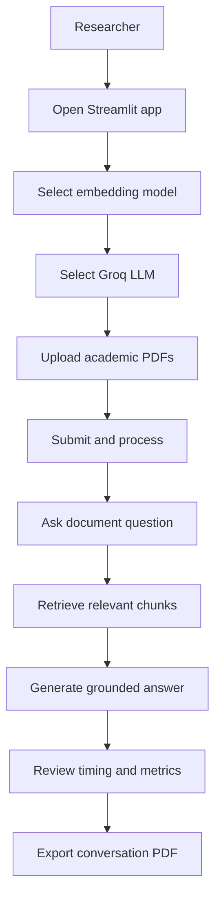
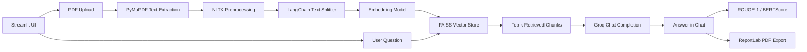

# MonkieBot

MonkieBot is a Streamlit-based research prototype for testing retrieval-augmented PDF question answering. It was used as the implementation surface for the paper **"Optimizing Document Interaction Using Large Language Models by Integrating Retrieval-Augmented Generation, Facebook AI Similarity Search, and Human-like Performance Metrics"** by Edwina Hon Kai Xin, Zhi Wei Tan, Ling Hue Wee, and Chi Wee Tan.

The app lets a reader upload academic PDFs, indexes the extracted text with FAISS, asks Groq-hosted LLMs questions against retrieved context, and reports response timing plus optional quality metrics. For a visual summary of the paper and benchmark framing, see [`read-me.html`](./read-me.html).

## Story Scenario

A student or researcher is reviewing dense academic PDFs and needs fast, source-grounded answers without manually scanning every section. They upload the paper into MonkieBot, ask targeted questions, and compare how different embedding and LLM combinations behave on the same document.

## Problem Statement

Long academic PDFs are difficult for plain chatbots because the document can exceed context limits, contain multiple topics, and require exact source details. A general-purpose LLM may answer fluently while missing the relevant passage or relying on prior knowledge instead of the uploaded file.

The paper tested whether a retrieval-first pipeline can make document interaction more reliable, measurable, and usable for research-style question answering.

## Solution

MonkieBot separates document Q&A into a measured RAG pipeline:

- Extract PDF text with PyMuPDF.
- Clean and normalize text with NLTK preprocessing.
- Split the document into overlapping chunks.
- Embed chunks with selectable Hugging Face / Instructor embedding models.
- Store and search vectors with FAISS.
- Send the most relevant chunks to a Groq-hosted LLM.
- Return an answer with response time and model information.
- Compare selected answers against ground-truth examples with ROUGE-1 and BERTScore.
- Export the conversation transcript to PDF.

## Product Concept

MonkieBot is a local document intelligence app for academic PDF analysis and RAG experimentation.

| Area | Implemented Behavior |
| --- | --- |
| PDF ingestion | Upload one or more PDF files through the Streamlit sidebar |
| Text extraction | Uses PyMuPDF block extraction and sorts blocks by vertical position |
| Text preparation | Lowercases, removes punctuation/numbers, tokenizes, removes stopwords, and lemmatizes |
| Retrieval | Creates 1,000-character chunks with 200-character overlap and stores them in FAISS |
| Model comparison | Lets the user choose embedding and Groq LLM models from the UI |
| Evaluation | Computes ROUGE-1 and BERTScore for hard-coded sample Q&A when the question matches |
| Export | Downloads the full or selected chat transcript as a PDF |

## User Flow



## System Architecture Flow



## Tech Stack

| Layer | Tools |
| --- | --- |
| App UI | Streamlit |
| PDF processing | PyMuPDF (`fitz`) |
| Text preprocessing | NLTK |
| Chunking / orchestration | LangChain |
| Embeddings | `sentence-transformers/all-MiniLM-L6-v2`, `sentence-transformers/all-mpnet-base-v2`, `hkunlp/instructor-large` |
| Vector search | FAISS CPU |
| LLM inference | Groq API |
| Evaluation | ROUGE-1, BERTScore |
| Export | ReportLab |
| Environment | Python, `python-dotenv` |

## Smart Contracts

This project does not use smart contracts or blockchain infrastructure.

## Getting Started

### Prerequisites

- Python 3.10+ recommended
- A Groq API key
- `pip`

### Install

```bash
python -m venv .venv
source .venv/bin/activate
pip install -r requirements.txt
```

On Windows, activate the virtual environment with:

```bash
.venv\Scripts\activate
```

## Environment Variables

Create a `.env` file in the project root.

| Variable | Purpose |
| --- | --- |
| `GROQ_API_KEY` | API key used by the Groq Python client for LLM chat completions |

Example:

```bash
GROQ_API_KEY=your_groq_api_key_here
```

The repository does not currently include a `.env.example` file.

## Running Locally

```bash
streamlit run app.py
```

Streamlit will print a local URL, usually `http://localhost:8501`.

When the app starts, it downloads the NLTK corpora used by the preprocessing pipeline:

- `stopwords`
- `punkt`
- `punkt_tab`
- `wordnet`

In restricted environments, pre-download those corpora before running the app.

## Project Structure

```text
.
├── app.py              # Streamlit RAG app and evaluation logic
├── read-me.html        # Visual research explainer for the paper
├── readme.md           # Repository README
├── requirements.txt    # Python dependencies
└── skills-lock.json    # Local Codex skill metadata
```

## Demo / Screenshots

The repo includes [`read-me.html`](./read-me.html), a standalone visual explainer for the paper’s method, experiment framing, and selected findings.

To demo the application:

1. Start the Streamlit app.
2. Choose an embedding model and Groq LLM in the sidebar.
3. Upload one or more academic PDFs.
4. Click **Submit & Process**.
5. Ask questions in the chat input.
6. Download the conversation transcript from the sidebar if needed.

## Roadmap

- Add a `.env.example` file.
- Move hard-coded ground-truth Q&A into a configurable evaluation dataset.
- Persist evaluation results instead of printing metrics only to the terminal.
- Add citation snippets or page references in generated answers.
- Add a reproducible benchmark script for all embedding and LLM pairings described in the paper.
- Add screenshots or a hosted demo link.

## Notes

- This repository is a research/testing prototype, not a production document management system.
- FAISS indexes are stored in Streamlit session state and are rebuilt after each PDF processing run.
- The current app retrieves `k=2` chunks and limits retrieved context to roughly 2,000 characters before sending it to Groq.
- The paper explainer states that the study compared three embedding models with three LLMs across curated Q&A pairs and evaluated lexical, semantic, human-like, and latency dimensions.
- Unknown deployment details are intentionally not included; no live URL or production status was found in the repository.
